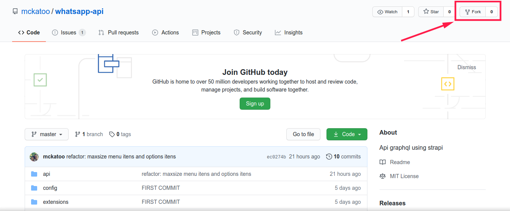

To clone and run this application, you'll need [Git](https://git-scm.com), [Node.js v12.18][nodejs] or higher + [Yarn v1.22][yarn] or higher installed on your computer. From your command line:

### Fork the repository



```bash
# Clone this forked repository
$ git clone https://github.com/your_repository/whatsapp-api.git

# Go into the repository
$ cd whatsapp-api

# Add this remote repository
$ git remote add mckatoo https://github.com/mckatoo/whatsapp-api.git

# Update your local repository if necessary
$ git fetch mckatoo

# Merge your local repository with recentily pushed
$ git merge mckatoo/master

# Push local repository updated for your remote repository
$ git push

# Never work on the main branch
$ git checkout -b your-branch

# There, you can start the job.

# Install dependencies
$ yarn
# or
$ npm install

# Run the app
$ yarn develop
# or
$ npm run develop

# After the modifications are finished, do it.
$ git add .
$ git commit

# This project uses commitizen and commitlint to standardize and organize commits.
# Follow the steps indicated by commitizen.

# After committing, it's time to send your branch
$ git push origin your-branch

# To open a pull request go to your github repository and click on the green button labeled 'Compare & pull request'
# Check all the data and describe the pull request with clear and direct information.
# Click on the green button labeled 'Create pull request'.
# Okay, now just wait for approval or not.
```

For a better illustration of the process, follow a video by [Diego Fernandes of RocketSeat](https://youtu.be/mcd7lqpUzIA)
